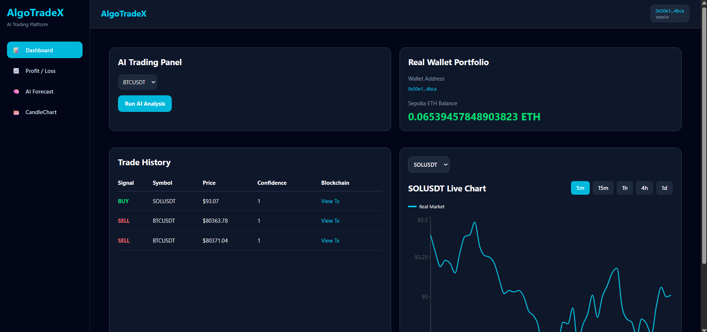
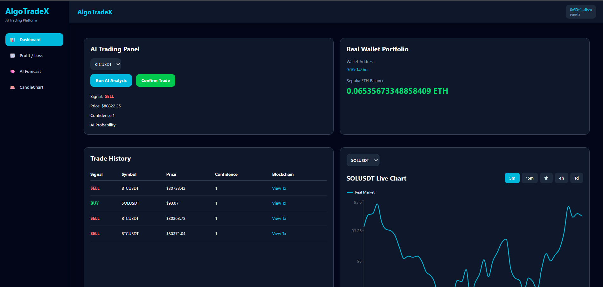
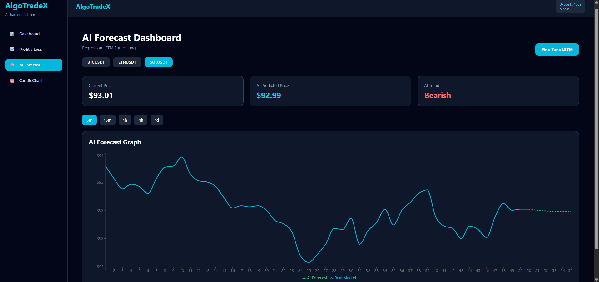
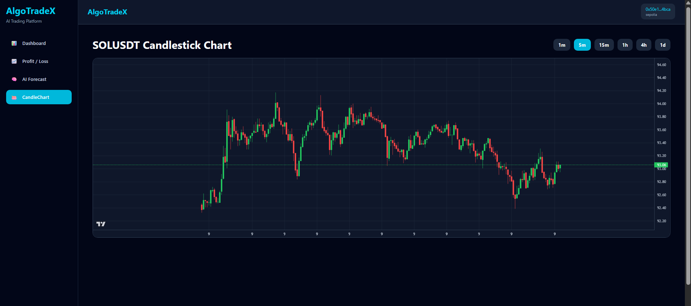
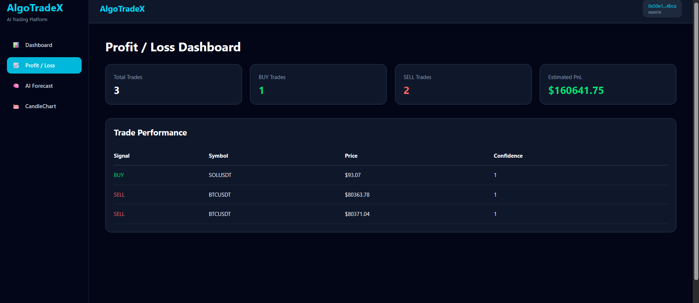
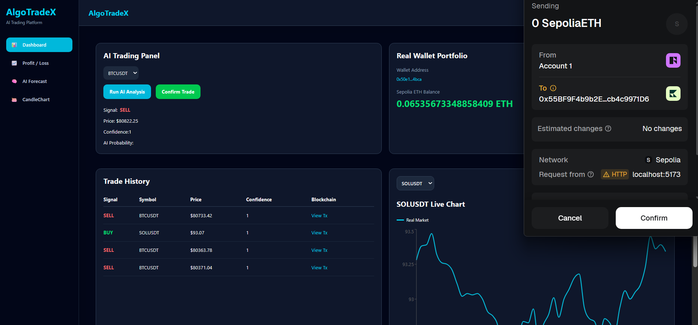

# 🚀 AlgoTradeX

AI-Powered Crypto Trading Platform using React, Node.js, TensorFlow, MongoDB, and Web3.

---

# 📌 Overview

AlgoTradeX is a full-stack AI trading platform that combines:

- AI-based trading signals
- LSTM price forecasting
- Candlestick market charts
- Paper trading portfolio
- MetaMask blockchain integration
- Trade history tracking
- Backtesting engine
- Real-time Binance market data

The platform simulates a modern quantitative trading dashboard similar to Binance or TradingView.

---

# 🧠 Features

## ✅ AI Trading Engine
- BUY / SELL / HOLD signal generation
- TensorFlow LSTM models
- Confidence score analysis
- Multi-symbol support

---

## 📈 Live Market Charts
- Real-time Binance data
- Recharts line graphs
- TradingView-style candlestick charts
- Multiple intervals:
  - 1m
  - 5m
  - 15m
  - 1h
  - 4h
  - 1d

---

## 🤖 AI Forecasting
- Future price prediction
- Regression forecasting
- Multi-symbol AI forecasting
- Confidence analysis

---

## 💼 Portfolio System
- Real wallet integration
- MetaMask support
- Ethereum balance tracking
- Paper trading simulation
- Portfolio analytics

---

## 📜 Trade History
- MongoDB trade storage
- BUY / SELL tracking
- Blockchain transaction hashes
- Real-time history updates

---

## 📊 Backtesting Engine
- Historical simulation
- Win rate calculation
- Profit/Loss analysis
- Maximum drawdown
- Strategy performance testing

---

# 🏗️ Tech Stack

## Frontend
- React.js
- TailwindCSS
- Recharts
- Lightweight Charts
- React Router

---

## Backend
- Node.js
- Express.js
- MongoDB
- Mongoose

---

## AI / Machine Learning
- Python
- Flask
- TensorFlow
- Keras
- LSTM Models
- Scikit-learn

---

## Blockchain
- Solidity
- Ethers.js
- MetaMask
- Sepolia Testnet

---

# 📂 Project Structure

```text
AlgoTradeX/
│
├── client/          # React Frontend
├── server/          # Node.js Backend
├── ai/              # Flask AI Server
├── contracts/       # Solidity Smart Contracts
├── models/          # TensorFlow Models
├── README.md
└── .gitignore
```

---

# ⚙️ Installation

# 1️⃣ Clone Repository

```bash
git clone https://github.com/YOUR_USERNAME/AlgoTradeX.git
```

---

# 2️⃣ Frontend Setup

```bash
cd client
npm install
npm run dev
```

Frontend runs on:

```text
http://localhost:5173
```

---

# 3️⃣ Backend Setup

```bash
cd server
npm install
node server.js
```

Backend runs on:

```text
http://localhost:5000
```

---

# 4️⃣ AI Server Setup

```bash
cd ai
pip install -r requirements.txt
python app.py
```

AI server runs on:

```text
http://localhost:5001
```

---

# 🔐 Environment Variables

Create `.env` file inside backend folder.

Example:

```env
USER=USER

PASSWORD=PASSWORD

MONGO_URI=MONGO_URI

RPC_URL_INFYURA=RPC_URL_INFYURA

PRIVATE_KEY=PRIVATE_KEY

CONTRACT_ADDRESS=CONTRACT_ADDRESS
```

---

# 📸 Screenshots

---

## 🏠 Dashboard



---

## 🤖 AI Trading Panel



---

## 📈 AI Forecast Dashboard



---

## 🕯️ Candlestick Chart



---

## 📊 Profit / Loss Dashboard



---

## 🔗 MetaMask Transaction Confirmation




---

# 🔮 Future Improvements

- Reinforcement Learning Trading Agent
- Sentiment Analysis from News/Twitter
- Multi-Agent AI System
- Risk Management Engine
- Live Auto-Trading
- Advanced Portfolio Analytics
- WebSocket Real-time Streaming
- Multi-exchange support

---

# 👨‍💻 Author

Tushar Fodse

---

# ⭐ If you like this project

Give it a star on GitHub ⭐
